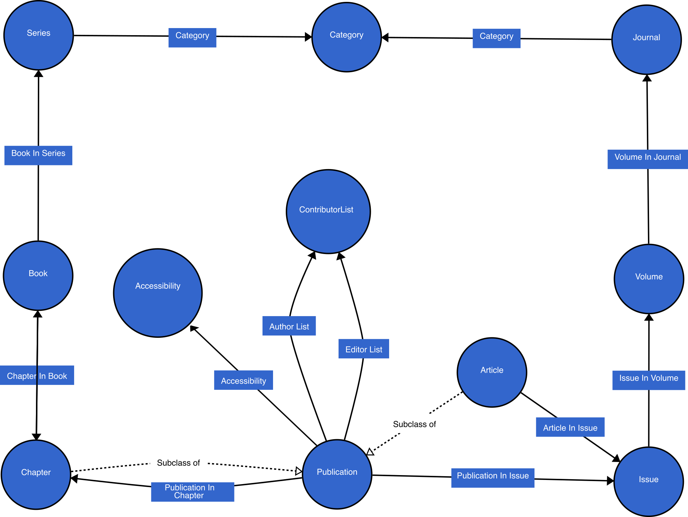
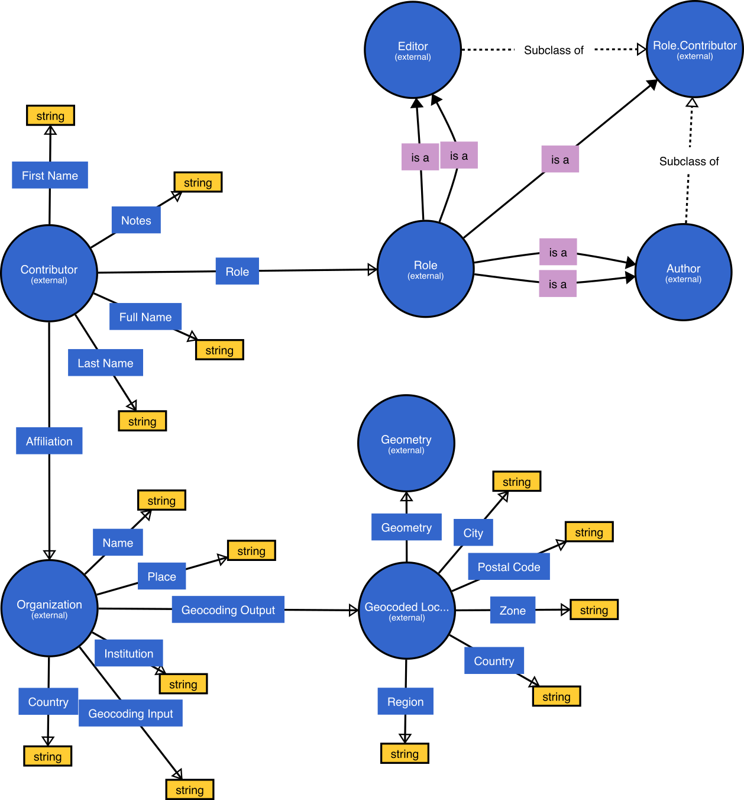

# LD-Connect
[LD Connect](http://ld.iospress.nl/) is a Linked Data portal for [IOS Press scientometrics](http://stko-roy.geog.ucsb.edu:7200/iospress_scientometrics), consisting of all IOS Press bibliographic data enriched by geographic information. This is a work funded by [IOS Press](https://www.iospress.com/) in collaboration with the [STKO lab](https://github.com/stko-lab) at [UC Santa Barbara](https://www.ucsb.edu/). A SPARQL endpoint for retrieving information in LD Connect is published as [`http://ld.iospress.nl:7200/`]([http://ld.iospress.nl:7200).

## Ontology
The ontology file can be found at  [`data/ontology/ontology.ttl`](data/ontology/ontology.ttl). Two schema diagrams below show ontology fragments of [`iospress:Publication`](http://ld.iospress.nl/rdf/ontology/Publication) and [`iospress:Contributor`](http://ld.iospress.nl/rdf/ontology/Contributor) respectively.

<div align=center>

</div>

<div align=center>

</div>


A sample SPARQL query is provided below, which is used to retrieve information about papers whose first author is from affiliations located in China.
```SPARQL
select ?title (group_concat(?keyword; separator=',')
       as ?keywords) ?year ?journal ?first_author_name ?org_name 
{
    ?paper iospress:publicationTitle ?title;
           iospress:publicationIncludesKeyword ?keyword;
           iospress:publicationDate ?date;
           iospress:articleInIssue/iospress:issueInVolume/
           iospress:volumeInJournal ?journal;
           iospress:publicationAuthorList ?author_list.
    ?author_list rdf:_0 ?first_author.
    ?first_author iospress:contributorFullName ?first_author_name;
                  iospress:contributorAffiliation ?org.
    ?org iospress:geocodingInput ?org_name ;
		 iospress:geocodingOutput/
		 iospress-geocode:country ?org_country.    
    bind(year(?date) as ?year)
    values ?org_country {"China"@en}
} group by ?title ?year ?journal ?first_author_name ?org_name
```

## Embeddings
A version of pre-trained embeddings are located in  [`data/embeddings/`](data/embeddings/). Right now we have provided document embeddings in plain text format (see [`data/embeddings/IOS-Doc2Vec/model-txt/`](data/embeddings/IOS-Doc2Vec/model-txt/)). After we upgraded the storage for this repository, we will continue uploading document embeddings used with [gensim](https://radimrehurek.com/gensim/) 3.3.0 library, knowledge graph embeddings and a JSON file about how same entities (e.g., contributors, affiliations, etc.) are linked after co-reference resolution. More information about these embeddings can be found at [`http://ld.iospress.nl/about/about-data`](http://ld.iospress.nl/about/about-data), which is also the download site in LD Connect.

## IOS Press scientometrics
IOS Press scientometrics can be accessed through [`http://stko-roy.geog.ucsb.edu:7200/iospress_scientometrics`](http://stko-roy.geog.ucsb.edu:7200/iospress_scientometrics) (*note that the HTTP header should be used instead of HTTPS). These scientometrics include Home (a choropleth map), Country Collaboration, Author Map, Author Similarity, Paper Similarity, Keyword Graph and Streamgraph. Please select a journal category first and then a journal of interest for bibliographic analysis, visualization and embedding-based similarity search. An example about how information is displayed for the Semantic Web journal are attached below.

<div align=center>

</div>

<div align=center>

</div>

<div align=center>

</div>

<div align=center>

</div>

<div align=center>

</div>

<div align=center>

</div>

<div align=center>

</div>